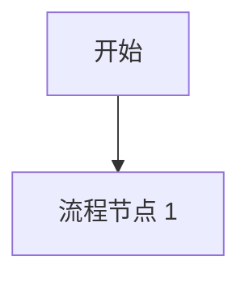

# [需求名称] 需求说明书

> **文档版本**: V1.0
> **更新日期**: YYYY-MM-DD
> **编制人**: BRS (业务需求文档记录员)
> **参与专家**: [列出所有参与讨论的专家代号]

---

## 目录
1. 项目背景与目标
2. 业务架构与流程
3. 详细功能需求
4. 非功能需求
5. 行业最佳实践对标
6. 附录：讨论过程与注解

---

## 1. 项目背景与目标

### 1.1 业务痛点
> **用户故事**: 作为 [角色]，我需要 [功能]，以便 [价值]。

### 1.2 核心价值
*   **降本/增效/提质/创收**: [具体描述]

### 1.3 适用范围
*   [适用业态/场景/部门]

## 2. 业务架构与流程

### 2.1 标准业务流程 (SOP)

### 2.2 异常与降级流程
*   [列举常见异常，如断网、审批驳回、数据不一致等]

## 3. 详细功能需求

### 3.1 核心模块 A
#### 3.1.1 功能项 A-1
- **需求描述**: ...
- **输入数据**: 
  | 字段名 | 类型 | 必填 | 校验规则 | 说明 |
  |---|---|---|---|---|
  | ... | ... | ... | ... | ... |
- **业务逻辑**: ...
- **输出数据**: ...

> [注解]: BRS 记录 - 此处 ENG 专家指出需增加 xxx 字段以支持后续联动。

### 3.2 核心模块 B
...

## 4. 非功能需求
| 指标 | 目标值 | 说明 |
|---|---|---|
| 性能 | ... | ... |
| 安全 | ... | ... |

## 5. 行业最佳实践对标
- **标杆做法**: ...
- **差距与策略**: ...

## 6. 讨论过程与注解
- [时间] [专家 A] vs [专家 B]: [争论点] -> [结论]
- > [注解]: ...